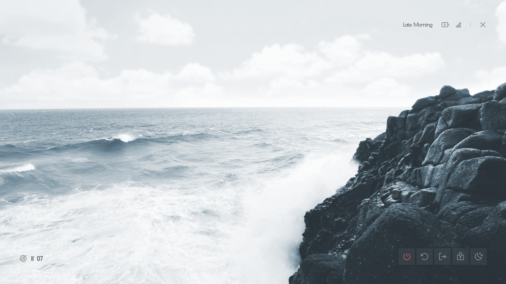

# Introduction

Hello there. Hope you are doing well. Lately, I have been playing with a neat
piece of software called [EWW](https://elkowar.github.io/eww). Making some
aesthetic UI, widgets and whatnot.

Note that, this has a very steep learning curve. This is because tutorials,
demo and examples about this are quite scarce. And the examples are either
too complex or, very poorly documented and not to mention most of them are
not even documented.

## Prerequisites

Some requirements about what you'd need to get started like what OS will this
work on, what languages you'd need to know, etc.

- Familiarity with Linux is required. This is for Linux users only.
- I will be using [Archlinux](https://archlinux.org) for this. [Debian](https://www.debian.org)
  users may
  need to translate some commands. But, for the most part equivalent commands
  will be provided.
- A bit of programming experience will be preferred.
- A [xorg](https://www.x.org) based
  [window manager](https://wiki.archlinux.org/title/Window_manager).
  Like [bspwm](https://github.com/baskerville/bspwm), [qtile](http://www.qtile.org/),
  [xmonad](https://xmonad.org/), etc. A [display environment](https://itsfoss.com/what-is-desktop-environment)
  will work as well.

  
  This tutorial is designed for running EWW on a xorg-based
  window manager, but minimal changes should be able to make it run on wayland.
  See [build flags](https://elkowar.github.io/eww/#building) and [widget definitions](https://elkowar.github.io/eww/configuration.html#wayland).
  

## Dependencies

Packages that are needed for this to work correctly.


You may use [command-not-found](https://command-not-found.com) if
you do not know what a package is called for your distro (Arch's and
Debian's package naming conventions are quite different).


- First and foremost you will need [EWW](https://elkowar.github.io/eww). Head
  over to their [website](https://elkowar.github.io/eww/eww.html#how-to-install-eww)
  and follow their instructions.
- And you would also need `sudo` which you already might have installed.
- Fonts used in this widget are
  [Poiret One](https://fonts.google.com/specimen/Poiret+One),
  [Koulen](https://fonts.google.com/specimen/Koulen) and [Phosphor](https://github.com/phosphor-icons/phosphor-icons/tree/master/src/fonts).
- `nmcli` tool that comes with Network Manager which you already might have installed.



```sh
## Debian
curl --proto '=https' --tlsv1.2 -sSf https://sh.rustup.rs | sh
git clone --depth 1 https://github.com/elkowar/eww.git
cd eww
# then install the *-devel variants of your distro
# SEE: https://elkowar.github.io/eww/#prerequisites

## Archlinux: Using an AUR helper like yay is advised.
## SEE: https://wiki.archlinux.org/title/AUR_helpers.
yay --sync eww-git # yay -S networkmanager --needed
```



That is all really.

## Setup

Getting things ready before we begin.

- For starters, you will need to create a folder at `~/.config/eww`.
- Then a few files at `~/.config/eww/eww.scss` and `~/.config/eww/eww.yuck`.
- A wallpaper. I'll be use [this](https://wallhaven.cc/w/dgzmxj) one from [wallhaven](https://wallhaven.cc)
  which was converted to OneDark using [ign](https://ign.schrodinger-hat.it/color-schemes).
  Rename the file as `wallpaper` (yes, remove the extension as well) and then
  put it in `~/.config/eww`.



```sh
mkdir ~/.config/eww
cd ~/.config/eww
touch eww.yuck eww.scss
```



All preparations are now complete. Now, we can start (Finally! 😃).

## Syntax

Introduction to yuck syntax, SCSS syntax and some handy shell commands.

### Yuck Syntax

The above heading may be confusing for new users, but it is legitimate.
The configuration file is literally called `eww.yuck` (pun intended).

> "EWW" is configured using its own language called yuck. Using yuck, you declare
  the structure and content of your widgets, the geometry, position, and behavior
  of any windows, as well as any state and data that will be used in your
  widgets. "Yuck" is based around S-expressions, which you may know from lisp-like
  languages.

Yuck is a lisp-based language (which is _based_) that uses parentheses quite
excessively as you will see in the subsequent sections. It can be hard to read
at first. But as most things you will adapt.


1. It is recommended to install [DSL](https://en.wikipedia.org/wiki/Domain-specific_language)
  plugins like [yuck.vim](https://github.com/elkowar/yuck.vim) for Vim users or,
  [yuck-vscode](https://github.com/owenrumney/yuck-vscode) if you use VSCode for
  syntax highlighting.

1. For Vim users you might want to use [vim-parinfer](https://github.com/bhurlow/vim-parinfer)
  for auto-indentation. Note that, the author of [yuck.vim](https://github.com/elkowar/yuck.vim)
  has already implemented auto-indentation to a specific degree.

1. Lastly, since I am a [Neovim](https://neovim.io) user therefore, I am 
  obligated to say this; You might want to use [nvim-parinfer](https://github.com/gpanders/nvim-parinfer)
  by [gpanders](https://github.com/gpanders) instead of the Vim version as this
  one is written in pure Lua and is generally faster than VimL, albeit a bit
  underdeveloped.


#### Defining A Window

A window is a box that stores things. In this case the "things" are known as
widgets (and no, windows are not widgets). EWW states that a window can only
house one widget. Now, a said widget may be a `box` which has the ability to
house multiple widgets, e.g. a `label` which will display a text as later
explained in the [Widgets That We Will Need]()
section.

For now, take a look at the following yuck snippet.

```fennel
(defwindow powermenu
  :stacking "fg"
  :windowtype "normal"
  :wm-ignore true
  :geometry (geometry
              :width "100%"
              :height "100%")
  (powermenu_layout))
```

This is a window definition in yuck syntax. Take a guess of what each of the
properties mean and crosscheck them from the following table.

|   Property         |   Description                                                                                                                                                                                                                                            |
|--------------------|----------------------------------------------------------------------------------------------------------------------------------------------------------------------------------------------------------------------------------------------------------|
|   width            |   Width of the window. Values may be provided in px or %.                                                                                                                                                                                                |
|   height           |   Height of the window. Values may be provided in px or %.                                                                                                                                                                                               |
|   stacking         |   Where the window should appear in the stack. Possible values: fg, bg.                                                                                                                                                                                  |
|   wm-ignore        |   Whether the window manager should ignore this window. This is useful for dashboard-style widgets that don't need to interact with other windows at all. Note that this makes some of the other properties not have any effect. Either true or false.   |
|   windowtype       |   Specify what type of window this is. This will be used by your window manager to determine how it should handle your window. Possible values: normal, dock, toolbar, dialog, desktop. Default: dock if reserve is specified, normal otherwise.         |


Always use `%` for widths and heights.


Learn more about properties from the [docs](https://elkowar.github.io/eww/configuration.html#defwindow-properties).

The `powermenu_layout` part is a custom widget.

#### Defining A Widget

Take a look at the following snippet.

```fennel
(defwidget powermenu_layout []
  (label :text "Hello, World!"))
```

This is a widget that will display the string "Hello, World!" once it has been
hooked into a window as you have seen above.

Additionally, you can also specify widget properties in a window definition.

```fennel
(defwindow powermenu
  :stacking "fg"
  :windowtype "normal"
  :wm-ignore true
  :geometry (geometry
              :width "100%"
              :height "100%")
  (label :text "Hello, World!"))

;; Alternatively
(defwindow powermenu
  :stacking "fg"
  :windowtype "normal"
  :wm-ignore true
  :geometry (geometry
              :width "100%"
              :height "100%")
  (box :orientation "vertical" :class "bx"
    (button :onclick "notify-send Hello")
    (label :text "Hello, World!")))
```

However, I would advise you against that since it would look congested and illegible.

#### Widgets That We Will Need

EWW has a plethora of built-in widgets that you can use for your own custom widget.
Out of those we will only need a few for this project, which are pretty basic.

- The [`label`](https://elkowar.github.io/eww/widgets.html#label) widget. It has
  the ability to print non-interactive text on the screen. But, it shines the
  most when used in conjunction with buttons, boxes, eventboxes (i.e. when
  nested within other widgets).

  ```fennel
  (label :text "Hello")
  ```

  Labels can also be implicitly defined.

  ```fennel
  (defwindow dummy
    :windowtype "normal"
    :geometry (geometry
                :width "100%"
                :height "100%")
    "Hello, World!") ;; this is also a label

- The [`button`](https://elkowar.github.io/eww/widgets.html#button) widget.
  It just executes a command on left, right and middle click.

  ```fennel
  (button :onclick "notify-send Left"
    :onrightclick "notify-send Right"
    "Click Me!") ;; this is a label nested within a button

- The [`box`](https://elkowar.github.io/eww/widgets.html#box) widget. It allows
  nesting widgets.

  ```fennel
  ;; :orientation "v" means the same
  (box :orientation "vertical" :class "bx"
    (label :text "This is a label.")
    (button :class "btn"
      (label
        :text "This is a label nested inside of a button."))
    "This is also a label."
    ;; no orientation means horizontal
    (box :class "nst-bx"
      ;; NOTE: You have to write more when you use an explicit label.
      ;;       So, in this case, I would follow a discipline to only
      ;;       use it when I need to apply another option to it like,
      ;;       limit-width.
      (label :text "Hello" :limit-width 4)
      (button :onclick "notify-send Left"
        :onmiddleclick "notify-send Middle"
        "Hello")))
  ```

  Note, **vertical** orientation will place the widgets in a top to bottom flow and
  **horizontal**, left to right.

> **Exercise**: Try to build a widget that will show "Hi there." and will
  consume the left half of the screen.

Learn more about other widgets and their properties from the
[docs](https://elkowar.github.io/eww/widgets.html#widgets).

#### Defining Variables And Dynamic Data

Take a look at [Showcase]() section. Notice that 
there are Network, Time and Battery information. Those are not interactive
widgets but they are dynamic. Rather, they display dynamic data. Like,
let's take the Time label in the bottom-left corner. This label will display
the new time value whenever the time changes.

So, if the time becomes `12:00` to `12:01`, the label will reflect that.
This is NOT automatic. You need to configure this behavior by using a poll
variable, that will run the `date` command at a specific interval and capture
the `STDOUT`.

Hence, consider the following.

```fennel
;; `` are just regular quotes
(defpoll time :interval "5s"
  `date +'{"hour":"%H","min":"%M"}'`)
```

Here, the command `date +'{"hour":"%H","min":"%M"}'` will be executed with
an interval of 5 seconds which will return `{"hour":"11","min":"30"}` for example.


The weird format string in the `date` call is known as [JSON](https://www.json.org).
`date +'%H:%M'` could be used instead but, know that a JSON string can also be used.


Now, you just need to _bind_ this to a widget label.

```fennel
(label :text date) ;; will display {"hour":"11","min":"30"} as is
(label :text {date.min}) ;; will display 30 - i.e. useful for JSON
(label :text "${date.hour} :: ${date.min}") ;; will display 11 :: 30
```

There are other kinds of variables as well which you can learn about from the
[docs](https://elkowar.github.io/eww/configuration.html#adding-dynamic-content).

#### Magic Variables

Convenient built-in variables that are added so that you do not have to do it yourself.
We'll only need [`EWW_BATTERY`](https://elkowar.github.io/eww/magic-vars.html#magic-variables)
for this one.

There are numerous magic variables which you will find in the
[docs](https://elkowar.github.io/eww/magic-vars.html#eww_battery).

### SCSS Syntax

EWW widgets are styled using [SCSS](https://sass-lang.com) which compiles to CSS.
Since it is a well known language I won't be teaching you SCSS/CSS; quite
frankly, there are numerous sites and videos that will explain this better.

Here are a few links. Keep in mind that you just need to learn CSS and then
gloss over them to get the differences between CSS and SCSS.

- [Official Documentation &#8212; sass-lang.com](https://sass-lang.com/documentation/syntax)
- [Beginner's Guide to Using SCSS &#8212; code-boost.com](https://www.code-boost.com/beginners-guide-to-scss)
- [The definitive guide to SCSS &#8212; logrocket.com](https://blog.logrocket.com/the-definitive-guide-to-scss)

You may want to learn CSS first if you do not know it.
[Learn CSS in 20 Minutes](https://youtu.be/1PnVor36_40) video by
[Web Dev Simplified](https://www.youtube.com/c/WebDevSimplified)
seems like a great place to start.


<br/>

- This is also nice to have [GTK3 CSS Overview](https://docs.gtk.org/gtk3/css-overview.html).

I hate to do this to you but, most of the things that SCSS provides
(like the [`use`](https://sass-lang.com/documentation/at-rules/use#configuration)
keyword) aren't supported in the EWW SCSS.

This may seem overwhelming... because you might be thinking of digesting all the
above links. This is wrong. Just get a general idea of CSS and use the links as mere
references. Use them as [Google](https://youtu.be/avCWDDox1nE). Refer to
the documentation, tutorials and videos _only_ if you are stuck or, want to
implement something new. Do not treat them as textbooks.

## Writing The Powermenu

Finally, we can actually write the Powermenu. Moving on...
This section will be divided into five subsections. Namely:

- Window Definition
- Variable Definitions
- Module Definitions
- Layouts and Positioning
- Styling with SCSS

Let's begin.

### Window Definition

We will define a window that will fill up the entire screen. Hence, the `width`
and `height` options in the window definition needs to be `100%`.

```fennel
(defwindow powermenu
  :stacking "fg"
  :windowtype "normal"
  :wm-ignore true
  :geometry (geometry :width "100%" :height "100%")
  (powermenu_layout))
```

See the [running]( "running the powermenu")
section to view the EWW window.


You need to replace `(powermenu_layout)` with "Testing..."
or, whatever to run this without any errors.


### Variable Definitions

As mentioned before, we need:

- Battery capacity value which can be fetched using the `EWW_BATTERY` variable.
  Find out the key value of your battery interface which can be found from
  `ls /sys/class/power_supply` prefixed with `BAT`. Now, take a note of
  `EWW_BATTERY.BAT0.capacity` and `EWW_BATTERY.BAT0.status`
  (this is for me. Yours might be `BAT1`, `BAT2`, etc.). We will need these later.
- For the network connectivity and strength, we can just use the following.

  ```sh
  nmcli -terse -fields SIGNAL,ACTIVE device wifi \
    | awk --field-separator ':' '{if($2=="yes")print$1}'
  ```

- For getting the current time we will use this `date +'{"hour":"%H","min":"%M"}'`.

Now, incorporate these into yuck-variables.

```fennel
(defpoll time :interval "5s"
  :initial `date +'{"hour":"%H","min":"%M"}'`
  `date +'{"hour":"%H","min":"%M"}'`)

(defpoll net :interval "100s"
  :initial `N/A`
  `nmcli -t -f SIGNAL,ACTIVE device wifi \
    | awk -F':' '{if($2=="yes")print$1}'`)
```

### Module Definitions

Dividing complex layouting into modules is not important at all. But, it will
be useful if something
decides to break or, if you want to add/remove widget(s).

This section is divided into five specific sub-sections.

- General Widget Options
- Buttons Module
- Battery Module
- Network Module
- Sundial Module

#### General Widget Options

These options or, properties can be applied to built-in widgets only. Like
`box`, `transform`, `scroll`, `label`, etc.

- **`class`**: `string` CSS class name.
- **`valign`**: `string` how to align this vertically. Possible values:
  `"fill"`, `"baseline"`, `"center"`, `"start"`, `"end"`.
- **`halign`**: `string` how to align this horizontally. Possible values:
  `"fill"`, `"baseline"`, `"center"`, `"start"`, `"end"`.
- **`vexpand`**: `bool` should this container expand vertically. Default: `false`.
- **`hexpand`**: `bool` should this widget expand horizontally. Default: `false`.
- **`width`**: `int` width of this element. Note that this can not restrict the
  size if the contents stretch it.
- **`height`**: `int` height of this element. Note that this can not restrict
  the size if the contents stretch it.
- **`active`**: `bool` If this widget can be interacted with.
- **`tooltip`**: `string` tooltip text (on hover).
- **`visible`**: `bool` visibility of the widget.
- **`style`**: `string` inline CSS style applied to the widget.

### How Do These Work?

Brief descriptions on how these options will affect your widgets.
Only `valign`, `vexpand`, `halign` and `hexpand` will be explained.
Rest are pretty intuitive.

Parse the following diagrams.



---



---



---

#### Buttons

This module will display the interactive control buttons at the bottom of
the window. Like a shutdown button, a reboot button, etc.


Now, consider the following yuck-snippet for this module. Treat the properties `shutdown`,
`shutdown_icon`, `logout_icon` as functional parameters.

```fennel
(defwidget _buttons [shutdown shutdown_icon reboot
                    reboot_icon logout logout_icon]
  (box :class "btns-box" :spacing 5
       :vexpand true :hexpand true
       :valign "end" :halign "end"
       :space-evenly false
    (button :onclick shutdown shutdown_icon)
    (button :onclick reboot reboot_icon)
    (button :onclick logout logout_icon)))
```

#### Network

We will classify network strength into four levels &#8212; excellent, good,
okay, slow and offline. This will be done using [ternary](https://developer.mozilla.org/en-US/docs/Web/JavaScript/Reference/Operators/Conditional_Operator)
operators. To illustrate this better following is a comparison between
ternary operators and normal conditionals in C.

```c
// if-else
int size = 0;
if (!size) size = 10;
else size = 15;

// ternary
int size = 0;
size = !size ? 10 : 15;
```


Finally, consider the following snippet.

```fennel
(defwidget _network [strength offline excellent good okay slow]
  (box :class "net-box"
       :space-evenly false
       :spacing 8
    (label :text {strength == "" ? offline :
      strength < 26 ? slow :
        strength < 51 ? okay :
          strength < 76 ? good : excellent})))
```

#### Battery

Battery current capacity is classified into eight levels. Namely, `one`,
`two`, `three`, `four`, `five`, `six`, `seven` and `charge`.


Hence, take a look at the following code snippet.

```fennel
(defwidget _battery [battery status one two three
                    four five six seven charge]
  (box :class "bat-box" :space-evenly false :spacing 8
    (label :text {status == 'Charging' ? charge :
      battery < 15 ? seven :
        battery < 30 ? six :
          battery < 45 ? five :
            battery < 60 ? four :
              battery < 75 ? three :
                battery < 95 ? two : one})))
```

#### Sundial

This should be the easiest of them all 💀. Jokes aside, this part
needs to be refactored. But, you should get the general idea regardless.
This module just displays the current **time-of-the-day** value. For
instance, the time between **17:00 and 17:59** (incl.) will be deemed as
"Late Afternoon".


Finally, consider the following snippet (no matter how bad it is). Just
get an idea of what it does 💀.

```fennel
(defwidget _sundial []
  (label :class "sundial-lbl" :halign "end" :hexpand true
         :text {time.hour >= 2 && time.hour <= 4 ? "Early Morning" :
               time.hour <= 5 ? "Dawn" :
               time.hour >= 6 &&
                (time.hour <= 8 &&
                  time.min <= 59) ? "Morning" :
               time.hour >= 9 &&
                (time.hour <= 11 && time.min <= 59)
                ? "Late Morning" :
               time.hour == 12 && time.min <= 29 ? "Midday" :
               time.hour >= 12 && time.hour <= 16 ? "Afternoon" :
               time.hour > 16 && time.hour <= 17 ?
                "Late Afternoon" :
               (time.hour >= 17 && time.min <= 1)
                || (time.hour <= 18 && time.min <= 20) ?
                  "Early Evening" :
               time.hour >= 18 && time.hour <= 19 ? "Dusk" :
               time.hour > 19 && time.hour <= 21 ? "Late Evening" :
               time.hour > 21 ? "Night" : "Midnight"}))
```

### Layouts and Positioning

Now, we will glue all the modules and bare widgets into a single widget
called `powermenu_layout`.

```fennel
(defwidget powermenu_layout []
  (box :class "layout-box" :space-evenly false :orientation "vertical"
       :style "background-image: url('./wallpaper')"
    (box :valign "start" :space-evenly false :spacing 25
      (_sundial)
      (_battery :status {EWW_BATTERY.BAT0.status}
                :battery {EWW_BATTERY.BAT0.capacity}
                :charge "" :one "" :two "" :three "" :four ""
                :five "" :six "" :seven "")
      (_network :strength net :offline "" :excellent "" :good ""
                :okay "" :slow "")
      (label :text "|" :class "sep")
      (button :onclick "eww close powermenu" :class "close-btn" ""))
    (box :space-evenly false :hexpand true :vexpand true
      (box :spacing 15 :class "tm-box" :space-evenly false :valign "end"
           :halign "start"
        (label :text "")
        (label :text "${time.hour}  ${time.min}"))
      (_buttons :shutdown "poweroff" :reboot "reboot"
                :logout "loginctl kill-session self"
                :shutdown_icon "" :reboot_icon "" :logout_icon "")))
```


The glyphs may or, may not be visible as, you might not have the
font installed. You may need to install [nerd font](https://www.nerdfonts.com/font-downloads)
and [Phosphor Icons](https://github.com/phosphor-icons/phosphor-icons/tree/master/src/fonts).


### Styling with SCSS

I won't be explaining this. Just refer to the Sass docs.

```scss
$surface-darkgrey: #20252b;
$surface-fg: #949494;
$surface-lightgrey: #3d464e;
$surface-grey: #2b3238;
$surface-red: #f87070;

* { all: unset; }

.layout-box {
  font-family: Phosphor, Koulen;
  background-repeat: no-repeat;
  background-size: contain;
  padding: 5em;
  color: rgba($surface-fg, 0.8);
}

.net-box,
.bat-box,
.tm-box {
  label {
    font-size: 2em;
  }
}

.close-btn {
  font-size: 2em;
  &:hover {
    color: $surface-red;
  }
}

.btns-box {
  font-size: 2.5em;

  button {
    padding: 0.4em;
    border-radius: 0.1em;
    background-color: rgba($surface-darkgrey, 0.3);

    &:hover {
      transition: 200ms linear background-color, border-radius;
      background-color: rgba($surface-lightgrey, 0.6);
    }

    &:first-child {
      color: rgba($surface-red, 0.8);
    }
  }
}

.sep {
  font-size: 1.5em;
  padding-top: 0.15em;
  padding-left: 0.2em;
  padding-right: 0.2em;
  color: $surface-lightgrey;
}

.sundial-lbl {
  font-size: 1.5em;
  font-weight: bold;
  border-radius: 0.2em;
  padding: 0.4em;
  padding-bottom: 0.5em;
  font-family: "Poiret One";
}
```


`:class "name"` will correspond to `.name { color: pink; }` in SCSS.


## Full Code

Here is the full code.

```txt
.
└── eww-powermenu
    ├── eww.scss
    ├── eww.yuck
    └── wallpaper
```

```fennel
(defwindow powermenu
  :stacking "fg"
  :windowtype "normal"
  :wm-ignore true
  :geometry (geometry :width "100%" :height "100%")
  (powermenu_layout))

(defpoll time :interval "5s"
  :initial `date +'{"hour":"%H","min":"%M"}'`
  `date +'{"hour":"%H","min":"%M"}'`)
(defpoll net :interval "100s"
  :initial `N/A`
  `nmcli -t -f SIGNAL,ACTIVE device wifi \
    | awk -F':' '{if($2=="yes")print$1}'`)

(defwidget powermenu_layout []
  (box :class "layout-box" :space-evenly false :orientation "vertical"
       :style "background-image: url('./wallpaper')"
    (box :valign "start" :space-evenly false :spacing 25
      (_sundial)
      (_battery :status {EWW_BATTERY.BAT0.status}
                :battery {EWW_BATTERY.BAT0.capacity}
                :charge "" :one "" :two "" :three "" :four ""
                :five "" :six "" :seven "")
      (_network :strength net :offline "" :excellent "" :good ""
                :okay "" :slow "")
      (label :text "|" :class "sep")
      (button :onclick "eww close powermenu" :class "close-btn" ""))
    (box :space-evenly false :hexpand true :vexpand true
      (box :spacing 15 :class "tm-box" :space-evenly false
            :valign "end" :halign "start"
        (label :text "")
        (label :text "${time.hour}  ${time.min}"))
      (_buttons :shutdown "poweroff" :reboot "reboot"
                :logout "loginctl kill-session self"
                :shutdown_icon "" :reboot_icon ""
                :logout_icon ""))))

(defwidget _battery [battery status one two three
                    four five six seven charge]
  (box :class "bat-box" :space-evenly false :spacing 8
    (label :text {status == 'Charging' ? charge :
      battery < 15 ? seven :
        battery < 30 ? six :
          battery < 45 ? five :
            battery < 60 ? four :
              battery < 75 ? three :
                battery < 95 ? two : one})))

(defwidget _network [strength offline excellent
                    good okay slow]
  (box :class "net-box"
       :space-evenly false
       :spacing 8
    (label :text {strength == "" ? offline :
      strength < 26 ? slow :
        strength < 51 ? okay :
          strength < 76 ? good : excellent})))

(defwidget _buttons [shutdown shutdown_icon reboot
                    reboot_icon logout logout_icon]
  (box :class "btns-box" :spacing 5
       :vexpand true :hexpand true
       :valign "end" :halign "end"
       :space-evenly false
    (button :onclick shutdown shutdown_icon)
    (button :onclick reboot reboot_icon)
    (button :onclick logout logout_icon)))

(defwidget _sundial []
  (label :class "sundial-lbl" :halign "end" :hexpand true
         :text {time.hour >= 2 && time.hour <= 4 ? "Early Morning" :
               time.hour <= 5 ? "Dawn" :
               time.hour >= 6
                && (time.hour <= 8 && time.min <= 59)
                  ? "Morning" :
               time.hour >= 9
                 && (time.hour <= 11 && time.min <= 59)
                   ? "Late Morning" :
               time.hour == 12 && time.min <= 29
                 ? "Midday" :
               time.hour >= 12 && time.hour <= 16
                 ? "Afternoon" :
               time.hour > 16 && time.hour <= 17
                 ? "Late Afternoon" :
               (time.hour >= 17 && time.min <= 1)
                 || (time.hour <= 18 && time.min <= 20)
                   ? "Early Evening" :
               time.hour >= 18 && time.hour <= 19
                 ? "Dusk" :
               time.hour > 19 && time.hour <= 21
                 ? "Late Evening" :
               time.hour > 21 ? "Night" : "Midnight"}))

;; vim:ft=yuck
```

```scss
$surface-darkgrey: #20252b;
$surface-fg: #949494;
$surface-lightgrey: #3d464e;
$surface-grey: #2b3238;
$surface-red: #f87070;

* { all: unset; }

.layout-box {
  font-family: Phosphor, Koulen;
  background-repeat: no-repeat;
  background-size: contain;
  padding: 5em;
  color: rgba($surface-fg, 0.8);
}

.net-box,
.bat-box,
.tm-box {
  label {
    font-size: 2em;
  }
}

.close-btn {
  font-size: 2em;
  &:hover {
    color: $surface-red;
  }
}

.btns-box {
  font-size: 2.5em;

  button {
    padding: 0.4em;
    border-radius: 0.1em;
    background-color: rgba($surface-darkgrey, 0.3);

    &:hover {
      transition: 200ms linear background-color, border-radius;
      background-color: rgba($surface-lightgrey, 0.6);
    }

    &:first-child {
      color: rgba($surface-red, 0.8);
    }
  }
}

.sep {
  font-size: 1em;
  padding-top: 0.15em;
  padding-left: 0.2em;
  padding-right: 0.2em;
  font-family: Iosevka;
  font-weight: 400;
}

.sundial-lbl {
  font-size: 1.5em;
  font-weight: bold;
  border-radius: 0.2em;
  padding: 0.4em;
  padding-bottom: 0.5em;
  font-family: "Poiret One";
}

// vim:ft=scss
```

## Running The Powermenu

Moment of truth. Run the widget by executing the following command.

```sh
EWW open powermenu
```

And that is all really. If the widget looks like the following image
then congratulations, you have made it.


There are many neat `eww` flags that might interest you. Try `eww --help`
for starters. If anything 'does not work' then try looking at the
[debugging]( "debugging") section. The
[debugging]( "debugging") section might also help you
in solving general problems related to EWW.

## Debugging

Following are some of the things that you _should_ do before anything else if
the widget seems buggy or, not reflecting the changes that you've made.

- Always check the logs `eww logs`. Try the updating + saving combo i.e.,
  change a part of code then write those changes, and you will see real-time
  updates in the logs.
- You can check the state of what variables are active in currently or, if
  a variable is even yielding any results or not by using `eww state`.
  For the Powermenu the output might look like the following.

  ```sh
  EWW_BATTERY: {"BAT0": { "status": "Full", "capacity": 100 }, "total_avg": 100.0}
  net: 96
  time: {"hour":"12","min":"14"}
  ```

  This will work only if widgets i.e. if Powermenu is open. If any widgets are open
  then it will show the state of the variables being used by that.
- You can also use `eww get <variable_name>` like `eww get time` for selectively
  verifying the value of a variable and if it yields correct output or, not.
  This also will print values only if the widget window is open.
- A hot reload is always a good option. Trigger it by using `eww reload`.
- See if the EWW daemon is running by using `eww ping` and if the output is `pong`
  then it is responsive.
- List of windows available and opened can be seen by using `eww windows`.

  ```sh
  *disclose
  lumin
  vertigo
  origin
  ocular
  ```

  Where `disclose` is opened and rest are closed.
- If you notice that there are predefined colors, paddings, margins,
  etc. Then adding this `* { all: unset }` at the top of your SCSS file
  will disable that. This should be done to disable the theming configurations that
  come with your existing GTK theme.
- GTK Inspector is probably the most useful tool for debugging not just EWW widgets
  but, GTK widgets in general. If you are stuck or, do not know what component
  you want to style then open the inspector by `eww inspector` and then select the
  component by clicking on pointer button then drop the pointer arrow onto any
  part the EWW widget window.

  

- If these still did not solve your problem then make an
  [issue](https://github.com/elkowar/eww/issues)
  regarding it or, ask in the [discussions](https://github.com/elkowar/eww/discussions) tab.

## Tips

- If you are having difficulties implementing your own widget(s) then it might be a
  great idea to look at how other people implement that and adapt + incorporate
  that into your configuration. A great place to look for those would be
  [eugh](https://github.com/druskus20/eugh), [eww-bar](https://github.com/elkowar/eww/tree/master/examples/eww-bar)
  and [my gists](https://gist.github.com/dharmx).
- Commenting your code is always a good idea as, it will serve as a guide if you
  have forgotten what a specific part of code does.
- I initially planned to do this but, decided not to as it would be too
  much. Anyhow, the idea is to separate and segregate specific part of
  your yuck and SCSS code into separate files. Like putting `powermenu_layout` and
  all the modules in different files. Or, just put every module in separate files.
  You may use `(include "./path/to/file.yuck")` for importing yuck files and
  `@import "./path/to/file.scss"` for importing SCSS files.
- It is also a good idea to separate `*.yuck`, `*.scss` and script files into
  separate folders (Ahem! Directories. Pardon my French).
- Additionally there are sub-options in `eww` as well. Note that, this is not
  specified explicitly in the docs.

  ```sh
  eww open --toggle window
  eww open --help
  eww state --help
  eww --config ~/path/to/eww2 open window
  eww --config ~/path/to/eww2 open --toggle window
  ```

## Showcase

Behold! Feast your eyes! 🤩




## Projects That Use EWW

- [eww-widgets](https://github.com/Saimoomedits/eww-widgets) by 
- [dotfiles](https://github.com/Battlesquid/dotfiles) by 
- [eww-bar](https://github.com/elkowar/eww/tree/master/examples) by 
- [gross](https://github.com/iSparsh/gross) by 
- [hotfiles](https://github.com/Syndrizzle/hotfiles) by 
- [dotfiles](https://github.com/janleigh/dotfiles) by 
- [vile](https://github.com/dharmx/vile) by 
- [dotfiles-v2](https://github.com/AlphaTechnolog/dotfiles-v2) by 
- [dotfiles](https://github.com/siduck/dotfiles) by 
- [bspdots](https://github.com/rxyhn/bspdots) by 
- [widgets](https://github.com/adi1090x/widgets) by 

## Resouces

- [The EWW documentation website.](https://elkowar.github.io/eww)
- [My fairly large collection of EWW widgets.](https://github.com/dharmx/vile) by 
- [Simple examples of various builtin widgets](https://github.com/druskus20/eugh) by 
- [Example](https://github.com/elkowar/eww/tree/master/examples) by 
- [Examples of some EWW widgets in action **(Old)**](https://github.com/iSparsh/gross) by 
- [Neat, clever and original EWW widgets](https://github.com/Vermoot/dotfiles) by 

## References

- <https://elkowar.github.io/eww>
- <https://github.com/elkowar/eww>
- <https://github.com/dharmx/vile/tree/main/src/yuck/power>
- <https://github.com/dharmx/vile/tree/main/src/scss/power>
- <https://github.com/Vermoot/dotfiles>

## Ending Note

Let me know if you have any article requests involving EWW.
And, I hope you enjoyed building this. Cheers 🍻.
